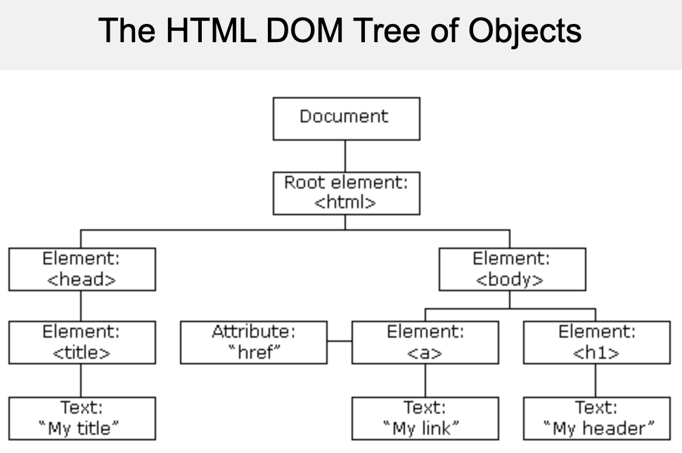

# DOM Manipulation

*a screenshot of the DOM from [w3schools.com](https://www.w3schools.com/js/js_htmldom.asp)*

__DOM__ = Document Object Model. The HTML

JavaScript can:

* change all the HTML elements in the page
* change all the HTML attributes in the page
* change all the CSS styles in the page
* remove existing HTML elements and attributes
* add new HTML elements and attributes
* react to all existing HTML events in the page
* create new HTML events in the page

Syntax example:
```html
<html>
<body>

<p id="demo"></p>

<script>
    document.getElementById("demo").innerHTML = "Hello World!";
</script>

</body>
</html>
```
The example changes the `innerHTML` content of the `<p id="demo">` element. The `getElementById` method is the most common way to access an HTML element. It uses the id of the element.

---
_sources:_ https://www.w3schools.com/js/js_htmldom.asp