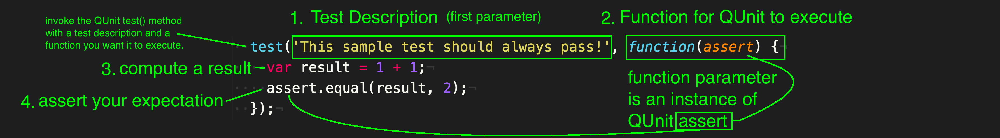

# Test-driven Development (TDD)
Test-driven development (TDD) is an evolutionary approach to development which combines test-first development, where you write a test before you write just enough production code to fulfill that test, and refactoring. In other words, it’s one way to think through your requirements or design before your write your functional code.

TDD follows a 3-step process - "Red, Green, Refactor":

1. Red: Write a Failing Test - Understand the (user) requirements/story well enough to write a test for what you expect. (the test should fail initially - hence it being "Red")
1. Green: Make the (failing) Test Pass - Write (only) the code you need to make the (failing) test pass, while ensuring your existing/previous tests all still pass (no regressions).
1. Refactor the code you wrote. Take time to tidy up the code you wrote to make it simpler (for your future self or colleagues to understand) before you need to ship the current feature.

You have two choices when it comes to testing: **manual testing** and **automated testing**.

## Manual Testing
Manual testing is the process of checking your application or code from the user’s perspective. Opening up the browser or program and navigating around in an attempt to test functionality and find bugs.

## Automated Testing
Automated testing is writing code that checks to see if other code works. Contrary to manual testing, the specifications remain constant from test to test. The biggest advantage is being able to test many things much faster.

It’s the combination of these two testing techniques that will flush out as many bugs and unintended side-effects as possible, and ensure your program does what you say it will.

**Automated tests** have 3 parts:

1. Description - usually the first parameter to QUnit's test() method, describing what is expected to happen in the test
1. Computation - executes a function/method (which invokes the method you will write to make your test pass)
1. Assertion - verifies that the result of your computation is what you expect it to be.

---
_sources:_ https://github.com/dwyl/learn-tdd, https://www.freecodecamp.org/news/an-introduction-to-test-driven-development-c4de6dce5c/